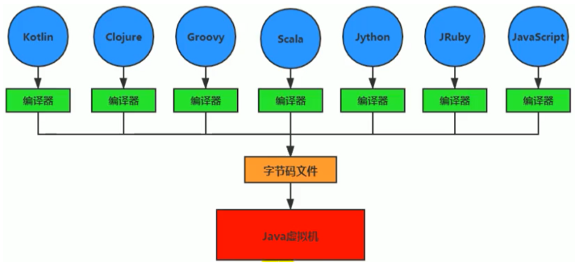
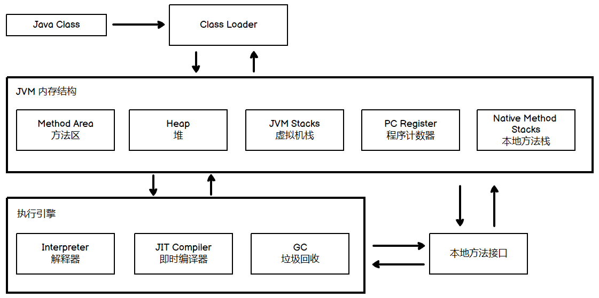

# 一、JVM是什么？

Java是一种高级编程语言，使用高级编程语言写出来的程序不能在机器上直接运行，因为机器只认识二进制。所以要想使写的Java程序能够运行，第一步就应该把Java code翻译成机器能识别的语言。

那么Java是如何做这件事情呢？如下图所示：

首先，我们的Java code会被`javac`编译器转换为`.class`字节码文件，接下来就交给JVM了

JVM全称`Java Virtual Machine`，他是一个虚拟的机器，他会再次编译字节码文件使得不同的操作系统能够识别并执行，所以这就是Java最显著的一个优点：**write once, run anywhere**

JVM并不关心运行在其内部的程序到底是使用什么语言编写的，它只关心字节码文件，也就是说：JVM与Java并没有必然的联系，它只与特定的字节码文件关联，如果其他语言也遵守字节码文件的规则，那么同样可以被JVM执行

# 二、JVM架构

JVM架构如下图所示：

接下来的Blog将针对每个部分进行学习

# 参考资料

- [B站黑马程序员JVM教程](https://www.bilibili.com/video/BV1yE411Z7AP)