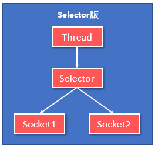
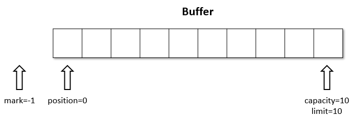
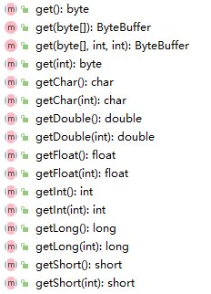

# NIO基础


# 一、NIO三大组件


## 1、Channel & Buffer

Channel有一点类似于stream，他就是读写数据的双向通道，可以从Channel将数据读入buffer，也可以将buffer的数据写入Channel，而之前的stream要么是输入，要么是输出，Channel比stream更为底层。

而Buffer就是Channel在传输数据时候的一个缓冲，也可以理解为Channel之间传递的数据：


常见的Channel有以下四种：

- FileChannel：文件传输
- DatagramChannel：UDP传输
- **SocketChannel：TCP传输，客户端**
- **ServerSocketChannel：TCP传输，服务器**

Buffer有以下几种，其中ByteBuffer使用的比较多：

- **ByteBuffer**
  - MappedByteBuffer
  - DirectByteBuffer
  - HeapByteBuffer
- `Short/Int/Long/Float/Double/Char`Buffer

下图是Buffer的类继承图，其中关于基本类型的Buffer则直接继承Buffer类，没有列出：


## 2、Selector

从服务器的设计演化理念来理解Selector：

**多线程版本设计**

即每来一个连接，就开辟一个线程分别去处理对应的连接以及事件


这种方式存在以下几个问题：

- 内存占用高
- 线程上下文切换成本高
- 只适合连接数少的情景


**线程池版本设计**

使用线程池，让线程池中的线程去处理连接


这种方式同样有一些问题：

- 阻塞模式下，线程仅能处理一个socket连接
- 仅适合短链接场景


**Selector版本设计**

Selector的作用就是配合一个线程来管理多个Channel，获取这些Channel上发生的事件，这些Channel工作在非阻塞模式下，不会让线程吊死在一个Channel上。适合连接数特别多，但流量低的场景



若事件未就绪，调用Selector的select()方法会阻塞线程，直到Channel发生了就绪事件。这些事件就绪后，select方法就会返回这些事件交给Thread来处理。


# 二、ByteBuffer


## 1、ByteBuffer的基本使用

使用ByteBuffer的正确姿势如下：

- 向Buffer写入数据，例如调用channel.read(buffer)
- 调用filp()切换至**读模式**
- 从buffer读取数据，例如调用buffer.get()
- 调用clear()或compact()切换至**写模式**
- 重复1~4步骤

比如，使用ByteBuffer读取文件内容：

```java
@Slf4j
public class TestByBuffer {
    public static void main(String[] args) {
        // FileChannel
        // 1、获取文件输入流FileInputStream
        try (FileChannel channel = new FileInputStream("input/clicks.csv").getChannel()) {
            // 2、准备缓冲区
            ByteBuffer buffer = ByteBuffer.allocate(16);
            // 从channel中读取数据，向buffer写入
            int len = 0;
            while ((len = channel.read(buffer)) != -1) {
                log.debug("读取到的字节 {}", len);
                // 打印buffer的内容
                buffer.flip();      // 切换到读模式
                StringBuilder sb = new StringBuilder();
                while (buffer.hasRemaining()) {
                    byte b = buffer.get();
                    sb.append((char) b);
                }
                System.out.println(sb);
                buffer.clear();     // 切换到写模式
            }
        } catch (Exception e) {

        }
    }
}
```


## 2、ByteBuffer的核心属性

ByteBuffer的父类Buffer中有几个核心属性，如下所示：

```java
// Invariants: mark <= position <= limit <= capacity
private int mark = -1;
private int position = 0;
private int limit;
private int capacity;
```

- **capacity：**缓冲区的容量。通过构造函数或者`allocate(int capacity)`赋予，**一旦设置，无法更改**
- **limit：**缓冲区的界限。位于limit后的数据不可读写。缓冲区的limit不能为负，并且**不能大于其容量**
- **position：**下一个读写位置的索引（下标）。缓冲区的位置不能为负，并且**不能大于limit**
- **mark：**记录当前position的位置。**position被改变后，可以通过reset()方法恢复到mark的位置**

以上四个属性必须满足：

```java
mark <= position <= limit <= capacity
```

Buffer提供position、limit、mark相关的方法，用户可以轻松获取该值，如果你愿意的话还可以自己设置


## 3、ByteBuffer的核心方法

在本章节将会使用图示展示各个方法是如何操作ByteBuffer的

### allocate(int capacity)

可以使用allocate方法为ByteBuffer分配空间，其他buffer类也有该方法



> - 使用allocate方法会创建HeapByteBuffer —— 基于java堆内存，读写效率低，会受到GC影响
> - 使用allocateDirect方法会创建DirectByteBuffer —— 直接内存，读写效率高（少一次拷贝），并且不会受GC影响，但是分配的效率低


### put()

- put()方法可以将一个数据放入缓冲区
- 进行该操作后，position的值会+1，指向下一个可以放入的位置。capacity=limit，为缓冲区容量的值


该方法还有一系列重载或者说同等作用的方法：


> :warning:需要注意的： 
>
> - putChar、putDouble等等方法会占用ByteBuffer中Char、Double等等个字节。
> - 具有两个参数的方法，可以指定index，即要插入的位置，但是不能超过limit，否则会抛出：IndexOutOfBoundsException或ReadOnlyBufferException异常


### flip()

- filp()方法会**切换对缓冲区的操作模式**，由 写 -> 读 / 读 -> 写
- 进行该操作后
  - 如果是写模式 -> 读模式，position=0，limit指向最后一个元素的下一个位置，capacity不变
  - 如果是读模式 -> 写模式，**一般不使用这个方法**，而是使用clean或compact方法


flip源码：

```java
public final Buffer flip() {
    limit = position;
    position = 0;
    mark = -1;
    return this;
}
```


### get()

- get()方法需要在读模式下使用
- get()方法会读取缓冲区中的一个值
- 进行该操作后，position++，如果超过了limit则会抛出异常


和put()方法一样，该方法也有一系列重载和功能相同的方法：



> :warning:需要注意的是：
>
> - get*(i)方法不会改变position的值
> - getChar()、getDouble()等等会读取对应字节个数据，此时position会加同等字节个数


### rewind()

- **rewind只能在读模式下使用**
- rewind本意为”倒带“，即将position置为0，mark置为-1


rewind源码：

```java
public final Buffer rewind() {
    position = 0;
    mark = -1;
    return this;
}
```


### clear() 和 compact()

两个方法都用于**在读模式的场景下，切换到写模式**，但是实现的机理是不一样的：

**clear()：**

- clear()方法会将缓冲区中的各个属性恢复到最初的状态，postion=0、capacity=limit、mark=-1
- 此时缓冲区的数据依然存在，处于”被遗忘“状态，下次进行写操作的时候会覆盖掉这些数据


clear源码：

```java
public final Buffer clear() {
    position = 0;
    limit = capacity;
    mark = -1;
    return this;
}
```


**compact()：**

- compact会把没有读完的数据向前压缩，然后切换到写模式
- 数据前移后，原位置的值并未清除，写时会覆盖之前的值


> clear只是对position、limit、mark进行重置，而compact在对position进行设置，以及limit、mark进行重置的同时，还涉及到数据在内存中的拷贝。所以compact比clear更耗性能。但compact能保存你未读取的数据，将新数据追加到未读取的数据之后；而clear不行，若你调用了clear，则未读取的数据很可能会直接被覆盖。


### mark() 和 reset()

- mark()方法会将position的值保存到mark属性中
- reset()方法会将position的值改为mark中保存的值


mark和reset源码：

```java
// mark方法
public final Buffer mark() {
    mark = position;
    return this;
}

// reset方法
public final Buffer reset() {
    int m = mark;
    if (m < 0)
        throw new InvalidMarkException();
    position = m;
    return this;
}
```


## 4、方法调用及演示


## 5、字符串与ByteBuffer的相互转换


## 5、粘包与半包


# 三、文件编程


# 四、网络编程


# 五、NIO与BIO

