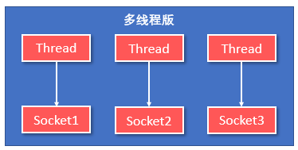
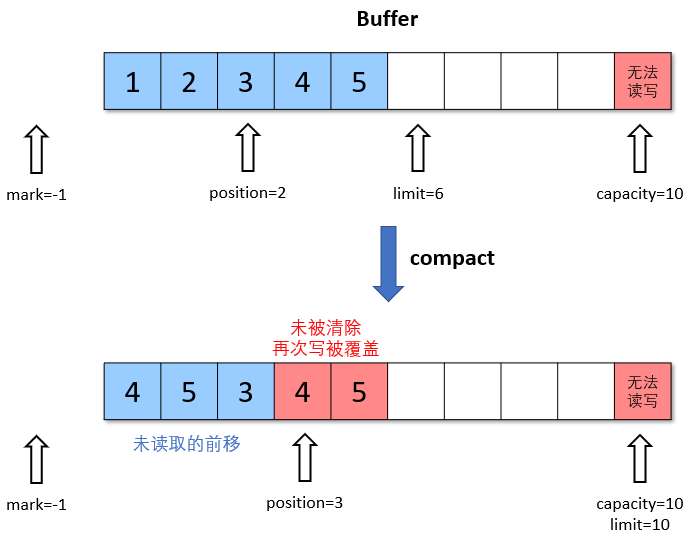
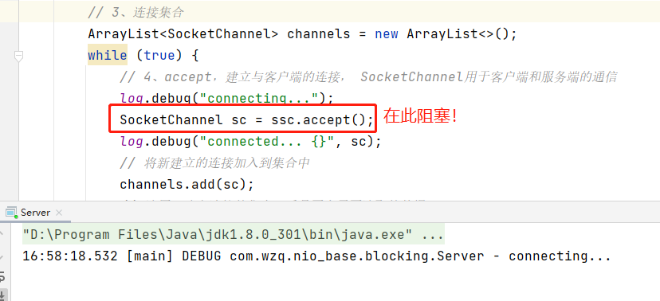
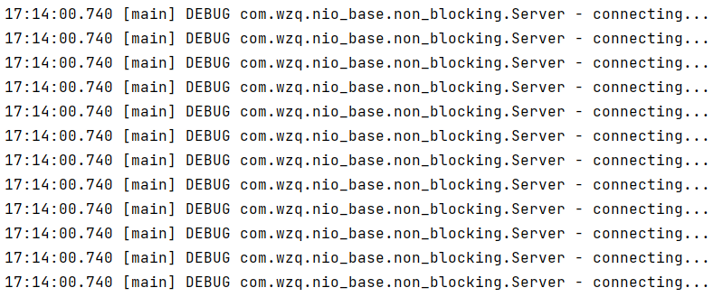

# NIO基础

> 本blog中所有code均在[com.wzq.nio_base](https://github.com/wzqwtt/BigData/tree/master/Netty/NettyLearn/src/main/java/com/wzq/nio_base)包下

# 一、NIO三大组件


## 1、Channel & Buffer

Channel有一点类似于stream，他就是读写数据的双向通道，可以从Channel将数据读入buffer，也可以将buffer的数据写入Channel，而之前的stream要么是输入，要么是输出，Channel比stream更为底层。

而Buffer就是Channel在传输数据时候的一个缓冲，也可以理解为Channel之间传递的数据：


常见的Channel有以下四种：

- FileChannel：文件传输
- DatagramChannel：UDP传输
- **SocketChannel：TCP传输，客户端**
- **ServerSocketChannel：TCP传输，服务器**

Buffer有以下几种，其中ByteBuffer使用的比较多：

- **ByteBuffer**
  - MappedByteBuffer
  - DirectByteBuffer
  - HeapByteBuffer
- `Short/Int/Long/Float/Double/Char`Buffer

下图是Buffer的类继承图，其中关于基本类型的Buffer则直接继承Buffer类，没有列出：


## 2、Selector

从服务器的设计演化理念来理解Selector：

**多线程版本设计**

即每来一个连接，就开辟一个线程分别去处理对应的连接以及事件



这种方式存在以下几个问题：

- 内存占用高
- 线程上下文切换成本高
- 只适合连接数少的情景


**线程池版本设计**

使用线程池，让线程池中的线程去处理连接


这种方式同样有一些问题：

- 阻塞模式下，线程仅能处理一个socket连接
- 仅适合短链接场景


**Selector版本设计**

Selector的作用就是配合一个线程来管理多个Channel，获取这些Channel上发生的事件，这些Channel工作在非阻塞模式下，不会让线程吊死在一个Channel上。适合连接数特别多，但流量低的场景


若事件未就绪，调用Selector的select()方法会阻塞线程，直到Channel发生了就绪事件。这些事件就绪后，select方法就会返回这些事件交给Thread来处理。


# 二、ByteBuffer


## 1、ByteBuffer的基本使用

使用ByteBuffer的正确姿势如下：

- 向Buffer写入数据，例如调用channel.read(buffer)
- 调用filp()切换至**读模式**
- 从buffer读取数据，例如调用buffer.get()
- 调用clear()或compact()切换至**写模式**
- 重复1~4步骤

比如，使用ByteBuffer读取文件内容：

```java
@Slf4j
public class TestByBuffer {
    public static void main(String[] args) {
        // FileChannel
        // 1、获取文件输入流FileInputStream
        try (FileChannel channel = new FileInputStream("input/clicks.csv").getChannel()) {
            // 2、准备缓冲区
            ByteBuffer buffer = ByteBuffer.allocate(16);
            // 从channel中读取数据，向buffer写入
            int len = 0;
            while ((len = channel.read(buffer)) != -1) {
                log.debug("读取到的字节 {}", len);
                // 打印buffer的内容
                buffer.flip();      // 切换到读模式
                StringBuilder sb = new StringBuilder();
                while (buffer.hasRemaining()) {
                    byte b = buffer.get();
                    sb.append((char) b);
                }
                System.out.println(sb);
                buffer.clear();     // 切换到写模式
            }
        } catch (Exception e) {

        }
    }
}
```


## 2、ByteBuffer的核心属性

ByteBuffer的父类Buffer中有几个核心属性，如下所示：

```java
// Invariants: mark <= position <= limit <= capacity
private int mark = -1;
private int position = 0;
private int limit;
private int capacity;
```

- **capacity：** 缓冲区的容量。通过构造函数或者`allocate(int capacity)`赋予，**一旦设置，无法更改**
- **limit：**缓冲区的界限。位于limit后的数据不可读写。缓冲区的limit不能为负，并且**不能大于其容量**
- **position：**下一个读写位置的索引（下标）。缓冲区的位置不能为负，并且**不能大于limit**
- **mark：** 记录当前position的位置。**position被改变后，可以通过reset()方法恢复到mark的位置**

以上四个属性必须满足：

```java
mark <= position <= limit <= capacity
```

Buffer提供position、limit、mark相关的方法，用户可以轻松获取该值，如果你愿意的话还可以自己设置


## 3、ByteBuffer的核心方法

在本章节将会使用图示展示各个方法是如何操作ByteBuffer的

### allocate(int capacity)

可以使用allocate方法为ByteBuffer分配空间，其他buffer类也有该方法


> - 使用allocate方法会创建HeapByteBuffer —— 基于java堆内存，读写效率低，会受到GC影响
> - 使用allocateDirect方法会创建DirectByteBuffer —— 直接内存，读写效率高（少一次拷贝），并且不会受GC影响，但是分配的效率低


### put()

- put()方法可以将一个数据放入缓冲区
- 进行该操作后，position的值会+1，指向下一个可以放入的位置。capacity=limit，为缓冲区容量的值


该方法还有一系列重载或者说同等作用的方法：


> :warning:需要注意的： 
>
> - putChar、putDouble等等方法会占用ByteBuffer中Char、Double等等个字节。
> - 具有两个参数的方法，可以指定index，即要插入的位置，但是不能超过limit，否则会抛出：IndexOutOfBoundsException或ReadOnlyBufferException异常


### flip()

- filp()方法会**切换对缓冲区的操作模式**，由 写 -> 读 / 读 -> 写
- 进行该操作后
  - 如果是写模式 -> 读模式，position=0，limit指向最后一个元素的下一个位置，capacity不变
  - 如果是读模式 -> 写模式，**一般不使用这个方法**，而是使用clean或compact方法


flip源码：

```java
public final Buffer flip() {
    limit = position;
    position = 0;
    mark = -1;
    return this;
}
```


### get()

- get()方法需要在读模式下使用
- get()方法会读取缓冲区中的一个值
- 进行该操作后，position++，如果超过了limit则会抛出异常


和put()方法一样，该方法也有一系列重载和功能相同的方法：


> :warning:需要注意的是：
>
> - get*(i)方法不会改变position的值
> - getChar()、getDouble()等等会读取对应字节个数据，此时position会加同等字节个数


### rewind()

- **rewind只能在读模式下使用**
- rewind本意为”倒带“，即将position置为0，mark置为-1


rewind源码：

```java
public final Buffer rewind() {
    position = 0;
    mark = -1;
    return this;
}
```


### clear() 和 compact()

两个方法都用于**在读模式的场景下，切换到写模式**，但是实现的机理是不一样的：

**clear()：**

- clear()方法会将缓冲区中的各个属性恢复到最初的状态，postion=0、capacity=limit、mark=-1
- 此时缓冲区的数据依然存在，处于”被遗忘“状态，下次进行写操作的时候会覆盖掉这些数据


clear源码：

```java
public final Buffer clear() {
    position = 0;
    limit = capacity;
    mark = -1;
    return this;
}
```


**compact()：**

- compact会把没有读完的数据向前压缩，然后切换到写模式
- 数据前移后，原位置的值并未清除，写时会覆盖之前的值



> clear只是对position、limit、mark进行重置，而compact在对position进行设置，以及limit、mark进行重置的同时，还涉及到数据在内存中的拷贝。所以compact比clear更耗性能。但compact能保存你未读取的数据，将新数据追加到未读取的数据之后；而clear不行，若你调用了clear，则未读取的数据很可能会直接被覆盖。


### mark() 和 reset()

- mark()方法会将position的值保存到mark属性中
- reset()方法会将position的值改为mark中保存的值


mark和reset源码：

```java
// mark方法
public final Buffer mark() {
    mark = position;
    return this;
}

// reset方法
public final Buffer reset() {
    int m = mark;
    if (m < 0)
        throw new InvalidMarkException();
    position = m;
    return this;
}
```


## 4、方法调用及演示


再开始之前，先引入一个ByteBuffer调试工具类，使用这个工具类需要先导入Netty依赖：

```xml
<!-- https://mvnrepository.com/artifact/io.netty/netty-all -->
<dependency>
    <groupId>io.netty</groupId>
    <artifactId>netty-all</artifactId>
    <version>4.1.84.Final</version>
</dependency>
```

```java
/**
 * @author Panwen Chen
 * @date 2021/4/12 15:59
 */
public class ByteBufferUtil {
    private static final char[] BYTE2CHAR = new char[256];
    private static final char[] HEXDUMP_TABLE = new char[256 * 4];
    private static final String[] HEXPADDING = new String[16];
    private static final String[] HEXDUMP_ROWPREFIXES = new String[65536 >>> 4];
    private static final String[] BYTE2HEX = new String[256];
    private static final String[] BYTEPADDING = new String[16];

    static {
        final char[] DIGITS = "0123456789abcdef".toCharArray();
        for (int i = 0; i < 256; i++) {
            HEXDUMP_TABLE[i << 1] = DIGITS[i >>> 4 & 0x0F];
            HEXDUMP_TABLE[(i << 1) + 1] = DIGITS[i & 0x0F];
        }

        int i;

        // Generate the lookup table for hex dump paddings
        for (i = 0; i < HEXPADDING.length; i++) {
            int padding = HEXPADDING.length - i;
            StringBuilder buf = new StringBuilder(padding * 3);
            for (int j = 0; j < padding; j++) {
                buf.append("   ");
            }
            HEXPADDING[i] = buf.toString();
        }

        // Generate the lookup table for the start-offset header in each row (up to 64KiB).
        for (i = 0; i < HEXDUMP_ROWPREFIXES.length; i++) {
            StringBuilder buf = new StringBuilder(12);
            buf.append(StringUtil.NEWLINE);
            buf.append(Long.toHexString(i << 4 & 0xFFFFFFFFL | 0x100000000L));
            buf.setCharAt(buf.length() - 9, '|');
            buf.append('|');
            HEXDUMP_ROWPREFIXES[i] = buf.toString();
        }

        // Generate the lookup table for byte-to-hex-dump conversion
        for (i = 0; i < BYTE2HEX.length; i++) {
            BYTE2HEX[i] = ' ' + StringUtil.byteToHexStringPadded(i);
        }

        // Generate the lookup table for byte dump paddings
        for (i = 0; i < BYTEPADDING.length; i++) {
            int padding = BYTEPADDING.length - i;
            StringBuilder buf = new StringBuilder(padding);
            for (int j = 0; j < padding; j++) {
                buf.append(' ');
            }
            BYTEPADDING[i] = buf.toString();
        }

        // Generate the lookup table for byte-to-char conversion
        for (i = 0; i < BYTE2CHAR.length; i++) {
            if (i <= 0x1f || i >= 0x7f) {
                BYTE2CHAR[i] = '.';
            } else {
                BYTE2CHAR[i] = (char) i;
            }
        }
    }

    /**
     * 打印所有内容
     * @param buffer
     */
    public static void debugAll(ByteBuffer buffer) {
        int oldlimit = buffer.limit();
        buffer.limit(buffer.capacity());
        StringBuilder origin = new StringBuilder(256);
        appendPrettyHexDump(origin, buffer, 0, buffer.capacity());
        System.out.println("+--------+-------------------- all ------------------------+----------------+");
        System.out.printf("position: [%d], limit: [%d]\n", buffer.position(), oldlimit);
        System.out.println(origin);
        buffer.limit(oldlimit);
    }

    /**
     * 打印可读取内容
     * @param buffer
     */
    public static void debugRead(ByteBuffer buffer) {
        StringBuilder builder = new StringBuilder(256);
        appendPrettyHexDump(builder, buffer, buffer.position(), buffer.limit() - buffer.position());
        System.out.println("+--------+-------------------- read -----------------------+----------------+");
        System.out.printf("position: [%d], limit: [%d]\n", buffer.position(), buffer.limit());
        System.out.println(builder);
    }

    private static void appendPrettyHexDump(StringBuilder dump, ByteBuffer buf, int offset, int length) {
        if (MathUtil.isOutOfBounds(offset, length, buf.capacity())) {
            throw new IndexOutOfBoundsException(
                    "expected: " + "0 <= offset(" + offset + ") <= offset + length(" + length
                            + ") <= " + "buf.capacity(" + buf.capacity() + ')');
        }
        if (length == 0) {
            return;
        }
        dump.append(
                "         +-------------------------------------------------+" +
                        StringUtil.NEWLINE + "         |  0  1  2  3  4  5  6  7  8  9  a  b  c  d  e  f |" +
                        StringUtil.NEWLINE + "+--------+-------------------------------------------------+----------------+");

        final int startIndex = offset;
        final int fullRows = length >>> 4;
        final int remainder = length & 0xF;

        // Dump the rows which have 16 bytes.
        for (int row = 0; row < fullRows; row++) {
            int rowStartIndex = (row << 4) + startIndex;

            // Per-row prefix.
            appendHexDumpRowPrefix(dump, row, rowStartIndex);

            // Hex dump
            int rowEndIndex = rowStartIndex + 16;
            for (int j = rowStartIndex; j < rowEndIndex; j++) {
                dump.append(BYTE2HEX[getUnsignedByte(buf, j)]);
            }
            dump.append(" |");

            // ASCII dump
            for (int j = rowStartIndex; j < rowEndIndex; j++) {
                dump.append(BYTE2CHAR[getUnsignedByte(buf, j)]);
            }
            dump.append('|');
        }

        // Dump the last row which has less than 16 bytes.
        if (remainder != 0) {
            int rowStartIndex = (fullRows << 4) + startIndex;
            appendHexDumpRowPrefix(dump, fullRows, rowStartIndex);

            // Hex dump
            int rowEndIndex = rowStartIndex + remainder;
            for (int j = rowStartIndex; j < rowEndIndex; j++) {
                dump.append(BYTE2HEX[getUnsignedByte(buf, j)]);
            }
            dump.append(HEXPADDING[remainder]);
            dump.append(" |");

            // Ascii dump
            for (int j = rowStartIndex; j < rowEndIndex; j++) {
                dump.append(BYTE2CHAR[getUnsignedByte(buf, j)]);
            }
            dump.append(BYTEPADDING[remainder]);
            dump.append('|');
        }

        dump.append(StringUtil.NEWLINE +
                "+--------+-------------------------------------------------+----------------+");
    }

    private static void appendHexDumpRowPrefix(StringBuilder dump, int row, int rowStartIndex) {
        if (row < HEXDUMP_ROWPREFIXES.length) {
            dump.append(HEXDUMP_ROWPREFIXES[row]);
        } else {
            dump.append(StringUtil.NEWLINE);
            dump.append(Long.toHexString(rowStartIndex & 0xFFFFFFFFL | 0x100000000L));
            dump.setCharAt(dump.length() - 9, '|');
            dump.append('|');
        }
    }

    public static short getUnsignedByte(ByteBuffer buffer, int index) {
        return (short) (buffer.get(index) & 0xFF);
    }
}
```


调用ByteBuffer方法：

```java
@Slf4j
public class TestByteBufferMethod {

    public static void main(String[] args) {
        // 构造一个ByteBuffer
        ByteBuffer buffer = ByteBuffer.allocate(10);

        // 向buffer中写入1个字节的数据
        buffer.put((byte) 97);
        // 使用ByteBufferUtil工具类，查看buffer状态
        ByteBufferUtil.debugAll(buffer);

        // 向buffer中写入4个字节的数据
        buffer.put(new byte[]{98, 99, 100, 101});
        ByteBufferUtil.debugAll(buffer);

        // 获取数据
        buffer.flip();
        // flip之后打印三个属性的值
        log.debug("capacity:{},limit:{},position:{}", buffer.capacity(), buffer.limit(), buffer.position());
        System.out.println(buffer.get());
        System.out.println(buffer.get());
        ByteBufferUtil.debugAll(buffer);

        // 使用mark和reset标记
        buffer.mark();
        System.out.println(buffer.get());
        System.out.println(buffer.get());
        buffer.reset();
        ByteBufferUtil.debugAll(buffer);

        // 使用compact切换到写模式
        buffer.compact();
        ByteBufferUtil.debugAll(buffer);

        // 再次写入值
        buffer.put((byte) 102);
        buffer.put((byte) 103);
        ByteBufferUtil.debugAll(buffer);
    }
}
```

输出：

```java
// 写入一个字节的数据
+--------+-------------------- all ------------------------+----------------+
position: [1], limit: [10]
         +-------------------------------------------------+
         |  0  1  2  3  4  5  6  7  8  9  a  b  c  d  e  f |
+--------+-------------------------------------------------+----------------+
|00000000| 61 00 00 00 00 00 00 00 00 00                   |a.........      |
+--------+-------------------------------------------------+----------------+

// 继续写入四个字节的数据
+--------+-------------------- all ------------------------+----------------+
position: [5], limit: [10]
         +-------------------------------------------------+
         |  0  1  2  3  4  5  6  7  8  9  a  b  c  d  e  f |
+--------+-------------------------------------------------+----------------+
|00000000| 61 62 63 64 65 00 00 00 00 00                   |abcde.....      |
+--------+-------------------------------------------------+----------------+

// 打印capacity、limit、position              
19:21:55.787 [main] DEBUG com.wzq.nio_base.buffer.TestByteBufferMethod - capacity:10,limit:5,position:0
97
98
    
// 获取两个字节的数据     
+--------+-------------------- all ------------------------+----------------+
position: [2], limit: [5]
         +-------------------------------------------------+
         |  0  1  2  3  4  5  6  7  8  9  a  b  c  d  e  f |
+--------+-------------------------------------------------+----------------+
|00000000| 61 62 63 64 65 00 00 00 00 00                   |abcde.....      |
+--------+-------------------------------------------------+----------------+
99
100
             
// 标记完数据，再次reset回去              
+--------+-------------------- all ------------------------+----------------+
position: [2], limit: [5]
         +-------------------------------------------------+
         |  0  1  2  3  4  5  6  7  8  9  a  b  c  d  e  f |
+--------+-------------------------------------------------+----------------+
|00000000| 61 62 63 64 65 00 00 00 00 00                   |abcde.....      |
+--------+-------------------------------------------------+----------------+

// 使用compact切换到写模式              
+--------+-------------------- all ------------------------+----------------+
position: [3], limit: [10]
         +-------------------------------------------------+
         |  0  1  2  3  4  5  6  7  8  9  a  b  c  d  e  f |
+--------+-------------------------------------------------+----------------+
|00000000| 63 64 65 64 65 00 00 00 00 00                   |cdede.....      |
+--------+-------------------------------------------------+----------------+
             
// 再次写入两个字节的数据              
+--------+-------------------- all ------------------------+----------------+
position: [5], limit: [10]
         +-------------------------------------------------+
         |  0  1  2  3  4  5  6  7  8  9  a  b  c  d  e  f |
+--------+-------------------------------------------------+----------------+
|00000000| 63 64 65 66 67 00 00 00 00 00                   |cdefg.....      |
+--------+-------------------------------------------------+----------------+
```


## 5、字符串与ByteBuffer的相互转换

**方法一：**

**编码**：字符串调用getByte方法获得byte数组，将byte数组放入ByteBuffer中

**解码**：**先调用ByteBuffer的flip方法，然后通过StandardCharsets的decoder方法解码**

```java
public class Translate {
    public static void main(String[] args) {
        // 准备两个字符串
        String str1 = "hello";
        String str2 = "";

        ByteBuffer buffer1 = ByteBuffer.allocate(16);
        // 通过字符串的getByte方法获得字节数组，放入缓冲区中
        buffer1.put(str1.getBytes());
        ByteBufferUtil.debugAll(buffer1);

        // 将缓冲区中的数据转化为字符串
        // 切换模式
        buffer1.flip();
        
        // 通过StandardCharsets解码，获得CharBuffer，再通过toString获得字符串
        str2 = StandardCharsets.UTF_8.decode(buffer1).toString();
        System.out.println(str2);
        ByteBufferUtil.debugAll(buffer1);
    }
}
```

运行结果

```
+--------+-------------------- all ------------------------+----------------+
position: [5], limit: [16]
         +-------------------------------------------------+
         |  0  1  2  3  4  5  6  7  8  9  a  b  c  d  e  f |
+--------+-------------------------------------------------+----------------+
|00000000| 68 65 6c 6c 6f 00 00 00 00 00 00 00 00 00 00 00 |hello...........|
+--------+-------------------------------------------------+----------------+
hello
+--------+-------------------- all ------------------------+----------------+
position: [5], limit: [5]
         +-------------------------------------------------+
         |  0  1  2  3  4  5  6  7  8  9  a  b  c  d  e  f |
+--------+-------------------------------------------------+----------------+
|00000000| 68 65 6c 6c 6f 00 00 00 00 00 00 00 00 00 00 00 |hello...........|
+--------+-------------------------------------------------+----------------+Copy
```


**方法二：**

**编码**：通过StandardCharsets的encode方法获得ByteBuffer，此时获得的ByteBuffer为读模式，无需通过flip切换模式

**解码**：通过StandardCharsets的decoder方法解码

```java
public class Translate {
    public static void main(String[] args) {
        // 准备两个字符串
        String str1 = "hello";
        String str2 = "";

        // 通过StandardCharsets的encode方法获得ByteBuffer
        // 此时获得的ByteBuffer为读模式，无需通过flip切换模式
        ByteBuffer buffer1 = StandardCharsets.UTF_8.encode(str1);
        ByteBufferUtil.debugAll(buffer1);

        // 将缓冲区中的数据转化为字符串
        // 通过StandardCharsets解码，获得CharBuffer，再通过toString获得字符串
        str2 = StandardCharsets.UTF_8.decode(buffer1).toString();
        System.out.println(str2);
        ByteBufferUtil.debugAll(buffer1);
    }
}
```

运行结果

```
+--------+-------------------- all ------------------------+----------------+
position: [0], limit: [5]
         +-------------------------------------------------+
         |  0  1  2  3  4  5  6  7  8  9  a  b  c  d  e  f |
+--------+-------------------------------------------------+----------------+
|00000000| 68 65 6c 6c 6f                                  |hello           |
+--------+-------------------------------------------------+----------------+
hello
+--------+-------------------- all ------------------------+----------------+
position: [5], limit: [5]
         +-------------------------------------------------+
         |  0  1  2  3  4  5  6  7  8  9  a  b  c  d  e  f |
+--------+-------------------------------------------------+----------------+
|00000000| 68 65 6c 6c 6f                                  |hello           |
+--------+-------------------------------------------------+----------------+Copy
```


**方法三：**

**编码**：字符串调用getByte()方法获得字节数组，将字节数组传给**ByteBuffer的wrap()方法**，通过该方法获得ByteBuffer。**同样无需调用flip方法切换为读模式**

**解码**：通过StandardCharsets的decoder方法解码

```java
public class Translate {
    public static void main(String[] args) {
        // 准备两个字符串
        String str1 = "hello";
        String str2 = "";

        // 通过StandardCharsets的encode方法获得ByteBuffer
        // 此时获得的ByteBuffer为读模式，无需通过flip切换模式
        ByteBuffer buffer1 = ByteBuffer.wrap(str1.getBytes());
        ByteBufferUtil.debugAll(buffer1);

        // 将缓冲区中的数据转化为字符串
        // 通过StandardCharsets解码，获得CharBuffer，再通过toString获得字符串
        str2 = StandardCharsets.UTF_8.decode(buffer1).toString();
        System.out.println(str2);
        ByteBufferUtil.debugAll(buffer1);
    }
}
```

运行结果

```
+--------+-------------------- all ------------------------+----------------+
position: [0], limit: [5]
         +-------------------------------------------------+
         |  0  1  2  3  4  5  6  7  8  9  a  b  c  d  e  f |
+--------+-------------------------------------------------+----------------+
|00000000| 68 65 6c 6c 6f                                  |hello           |
+--------+-------------------------------------------------+----------------+
hello
+--------+-------------------- all ------------------------+----------------+
position: [5], limit: [5]
         +-------------------------------------------------+
         |  0  1  2  3  4  5  6  7  8  9  a  b  c  d  e  f |
+--------+-------------------------------------------------+----------------+
|00000000| 68 65 6c 6c 6f                                  |hello           |
+--------+-------------------------------------------------+----------------+
```


## 6、粘包与半包

**现象：**

网络上有多条数据发送给服务端，数据之间使用`\n`进行分隔

但由于某种原因这些数据在接收时，被进行了重新组合，例如原始数据有3条：

```
Hello,world\n
I'm wzqwtt\n
How are you?\n
```

变成了下面的两个ByteBuffer（粘包与半包）

```
Hello,world\nI'm wzqwtt\nHo
w are you?\n
```


**出现原因：**

- **粘包：** 发送方在发送数据时，并不是一条一条的发送数据，而是**将数据整合在一起**，当数据达到一定的数量后再一起发送。这就会导致多条信息被放在一个缓冲区被一起发送出去
- **半包：** 接收方的缓冲区大小是有限的，当接收方的缓存区满了以后，就需要**将信息截断**，等缓冲区空了以后再继续放入数据。这就会发生一段完整的数据最后被截断的现象


**解决办法：**

- 通过get(index)方法遍历ByteBuffer，遇到分隔符时进行处理。注意：get(index)不会改变position的值
  - 记录该段数据长度，以便于申请对应大小的缓冲区
  - 将缓冲区的数据通过get()方法写入到target中
- 调用**compact方法**切换模式，因为缓冲区中可能还有未读的数据

```java
@Slf4j
public class StickyAndHalfPack {

    public static void main(String[] args) {
        // 模拟粘包半包问题
        ByteBuffer source = ByteBuffer.allocate(32);
        source.put("Hello,world\nI'm wzqwtt\nHo".getBytes());
        split(source);  // 调用方法处理粘包半包问题
        source.put("w are you?\n".getBytes());
        split(source);  // 调用方法处理粘包半包问题
    }

    private static void split(ByteBuffer source) {
        // 切换到读模式
        source.flip();
        for (int i = 0; i < source.limit(); i++) {
            // 找到一条完整信息
            if (source.get(i) == '\n') {
                int length = i + 1 - source.position();
                // 把这条完整消息存入新的ByteBuffer
                ByteBuffer target = ByteBuffer.allocate(length);
                // 从source读，向target写
                for (int j = 0; j < length; j++) {
                    target.put(source.get());
                }
                ByteBufferUtil.debugAll(target);
            }
        }
        source.compact();
    }
}
```


# 三、文件编程

## 1、FileChannel

> :warning:FileChannel只能工作在阻塞模式下

### 获取

不能直接打开FileChannel，必须通过FileInputStream、FileOutputStream或者RandomAccessFile来获取FileChannel，它们都有`getChannel`方法

- 通过FileInputStream获取的Channel只能读
- 通过FileOutputStream获取的Channel只能写
- 通过RandomAccessFile是否能读写需要根据构造RandomAccessFile时的读写模式决定

### 读取

会从channel读取数据填充到ByteBuffer，返回值表示读到了多少个自己，`-1`表示到达了文件的末尾

```java
int readBytes = 0;
while ((readBytes = channel.read(buffer)) != -1) {
    ....
}
```

### 写入

写入的正确姿势如下：

```java
ByteBuffer buffer = ...;
buffer.put(...);
buffer.flip();		// 切换到读模式

while (buffer.hasRemaining()) {
    channel.write(buffer);
}
```

在while中调用channel.write时因为write方法并不能保证一次将buffer中的内容全部写入channel

### 关闭

channel必须关闭，不过调用了FileInputStream、FileOutputStream或者RandowmAccessFile的close方法会间接的调用channel的close方法

### 位置

获取当前位置

```java
long pos = channel.position();
```

设置当前的位置

```java
channel.position(newPos);
```

设置当时位置时，如果设置为文件的末尾

- 这是读取会返回-1
- 这是写入，会追加内容，但要注意position超过了文件末尾，再写入时在新内容和原末尾之间会有空洞（00）

### 大小

使用size方法获取文件的大小

### 强制写入

操作系统出于性能的考虑，会将数据缓存，不是立刻写入磁盘。可以调用force(true)方法将文件内容和元数据（文件的权限灯信息）立刻写入磁盘


## 2、两个Channel传输数据

使用`TransferTo`方法，该方法可以快速、高效的将一个channel中的数据传输到另一个channel中，但一次只能传输2G的内容，另外：TransferTo方法底层使用零拷贝技术

```java
@Slf4j
public class TestFileChannelTransferTo {
    public static void main(String[] args) {
        try (
                // 读入数据
                FileChannel from = new FileInputStream("input/words.txt").getChannel();
                // 写出数据
                FileChannel to = new FileOutputStream("input/wordsCopy2.txt").getChannel();
        ) {
            // 因为一次只能传输2G的数据，所以我们循环传输
            long size = from.size();
            // left变量代表还剩余多少个字节
            for (long left = size; left > 0; ) {
                log.debug("position:{}, left:{}", (size - left), left);
                left -= from.transferTo((size - left), left, to);
            }
        } catch (Exception ex) {
            ex.printStackTrace();
        }
    }
}
```


## 3、Path

jdk7引入了Path和Paths类：

- **Path**用来表示文件路径
- **Paths**是工具类，用来获取Path实例

```java
Path source = Paths.get("1.txt");	// 相对路径，使用user.dir环境变量来定位1.txt

Path source = Paths.get("d:\\1.txt");	// 绝对路径

Path source = Paths.get("d:/1.txt");	// 绝对路径，同上

Path projects = Paths.get("d:\\data","projects");	// 代表了 d:\data\projects
```

例如：

```java
Path path = Paths.get("d:\\data\\projects\\a\\..\\b");
System.out.println(path);
System.out.println(path.normalize());	// 正常化路径
```

会输出：

```
d:\data\projects\a\..\b
d:\data\projects\b
```


## 4、Files

### 检查文件是否存在

```java
Path path = Paths.get("helloworld/data.txt");
System.out.println(Files.exist(path));
```

### 创建一级/多级目录

**一级目录：**

```java
Path path = Paths.get("helloworld/d1");
Files.createDircetory(path);
```

- 如果目录已存在，则会抛出FileAlreadyExistsException异常
- 不能一次创建多级目录，否则会抛出NoSuchFileException异常

**多级目录：**

```java
Path path = Paths.get("hellowrld/d1/d2");
Files.createDircetories(path);
```


### 拷贝文件

```java
Path source = Paths.get("data.txt");
Path target = Paths.get("data-copy.txt");

Files.copy(source,target);
```

- 如果文件已存在，会抛出FileAlreadyExistsException异常

如果希望用source覆盖掉target，需要用StandardCopyOption来控制

```java
File.copy(source,target,StandardCopyOption.REPLACE_EXISTING);
```


### 移动文件

```java
Path source = Paths.get("data.txt");
Path target = Paths.get("data-move.txt");

Files.move(source,target,StandardCopyOption.ATOMIC_MOVE);
```


### 删除文件

```java
Path target = Paths.get("data.txt");

Files.delete(target);
```

如果文件不存在，会抛出NoSuchFileException


### 删除目录

```java
Path target = Paths.get("d1");

Files.delete(target);
```

如果目录还有内容，会抛出DirectoryNotEmptyException


### 遍历目录

可以**使用Files工具类中的walkFileTree(Path, FileVisitor)方法**，其中需要传入两个参数

- Path：文件起始路径

- FileVisitor：文件访问器，

  使用访问者模式

  - 接口的实现类

    SimpleFileVisitor

    有四个方法

    - preVisitDirectory：访问目录前的操作
    - visitFile：访问文件的操作
    - visitFileFailed：访问文件失败时的操作
    - postVisitDirectory：访问目录后的操作

```java
public class TestFileWalkFileTree {
    public static void main(String[] args) throws IOException {
        AtomicInteger disCount = new AtomicInteger();
        AtomicInteger fileCount = new AtomicInteger();
        Files.walkFileTree(Paths.get("D:\\Program Files\\Java\\jdk1.8.0_301"), new SimpleFileVisitor<Path>() {
            // 访问目录
            @Override
            public FileVisitResult preVisitDirectory(Path dir, BasicFileAttributes attrs) throws IOException {
                disCount.incrementAndGet();
                System.out.println("====>" + dir);
                return super.preVisitDirectory(dir, attrs);
            }

            // 访问文件
            @Override
            public FileVisitResult visitFile(Path file, BasicFileAttributes attrs) throws IOException {
                System.out.println(file);
                fileCount.incrementAndGet();
                return super.visitFile(file, attrs);
            }
        });

        System.out.println("dir count: " + disCount);
        System.out.println("file count: " + fileCount);
    }
}
```

检查有多少以`.jar`结尾的文件：

```java
public class GetJarCount {
    public static void main(String[] args) throws IOException {
        AtomicInteger jarCount = new AtomicInteger();
        Files.walkFileTree(Paths.get("D:\\Program Files\\Java\\jdk1.8.0_301"),new SimpleFileVisitor<Path>(){
            @Override
            public FileVisitResult visitFile(Path file, BasicFileAttributes attrs) throws IOException {
                if (file.toString().endsWith(".jar")) {
                    System.out.println(file);
                    jarCount.incrementAndGet();
                }
                return super.visitFile(file, attrs);
            }
        });
        System.out.println("jar count: " + jarCount);
    }
}
```

拷贝多级目录：

```java
public class CopyDirectory {

    public static void main(String[] args) throws IOException {
        String source = "D:\\img";
        String target = "D:\\img-copy";

        Files.walk(Paths.get(source)).forEach(path -> {
            try {
                String targetName = path.toString().replace(source, target);
                // 如果是目录
                if (Files.isDirectory(path)) {
                    Files.createDirectory(Paths.get(targetName));
                } else {
                    // 是文件
                    Files.copy(path,Paths.get(targetName));
                }
            } catch (IOException e) {
                e.printStackTrace();
            }
        });
    }

}
```

删除多级目录：

```java
public class DeleteDircetory {

    public static void main(String[] args) throws IOException {
        Files.walkFileTree(Paths.get("D:\\img-copy"), new SimpleFileVisitor<Path>() {
            @Override
            public FileVisitResult visitFile(Path file, BasicFileAttributes attrs) throws IOException {
                Files.delete(file);
                return super.visitFile(file, attrs);
            }

            @Override
            public FileVisitResult postVisitDirectory(Path dir, IOException exc) throws IOException {
                Files.delete(dir);
                return super.postVisitDirectory(dir, exc);
            }
        });
    }
}
```


# 四、网络编程

## 1、非阻塞 VS 阻塞

**阻塞：**

- 在没有数据可读的时候，包括数据复制过程中，线程必须阻塞等待，不会占用CPU，线程相当于闲置
- 32位JVM一个线程320k，64位JVM一个线程1024k，为了减少线程数，需要采用线程池技术
- 但即便使用了线程池，如果有很多连接建立，但长时间的inactive，会阻塞线程池中所有线程

接下来，使用NIO的演示阻塞：

Server：

```java
@Slf4j
public class Server {
    public static void main(String[] args) throws IOException {
        // 使用NIO来理解线程的阻塞模式
        // 0. ByteBuffer
        ByteBuffer buffer = ByteBuffer.allocate(16);

        // 1、创建了服务器
        ServerSocketChannel ssc = ServerSocketChannel.open();

        // 2、绑定监听端口
        ssc.bind(new InetSocketAddress(7));

        // 3、连接集合
        ArrayList<SocketChannel> channels = new ArrayList<>();
        while (true) {
            // 4、accept，建立与客户端的连接， SocketChannel用于客户端和服务端的通信
            log.debug("connecting...");
            SocketChannel sc = ssc.accept();
            log.debug("connected... {}", sc);
            // 将新建立的连接加入到集合中
            channels.add(sc);
            // 遍历已建立连接的集合，看是否有需要读取的数据
            for (SocketChannel channel : channels) {
                log.debug("before read... {}", channel);
                channel.read(buffer);
                buffer.flip();
                ByteBufferUtil.debugRead(buffer);
                buffer.clear();
                log.debug("after read... {}", channel);
            }
        }
    }
}
```

Client：


此时先运行Server，如果没有client连接的情况下，会在`accept()`方法运行时候阻塞



这时，以Debug的方式运行Client，如果客户端没有消息发送给Server，会在`channel.read(buf)`方法上面阻塞


读者也可以试试再启动几个client，如果第一个channel读取不到任何信息，那么它将永远阻塞在这里


**非阻塞：**

- 在某个Channel没有可读事件时，线程不必阻塞，它可以去处理其他有可读事件的Channel
- 数据复制过程中，线程实际还是阻塞的
- 写数据时，线程只是等待数据写入Channel即可，无需等Channel通过网络把数据发送出去

更改上面的代码很简单，只需要改动ServerSocketChannel和SocketChannel，加一个`configureBlocking(false)`方法即可：

```java
@Slf4j
public class Server {

    public static void main(String[] args) throws IOException {
        // 0、创建一个ByteBuffer
        ByteBuffer buffer = ByteBuffer.allocate(10);

        // 1、创建一个ServerSocketChannel
        ServerSocketChannel ssc = ServerSocketChannel.open();
        // 2、绑定端口
        ssc.bind(new InetSocketAddress(7));
        // 3、配置非阻塞
        ssc.configureBlocking(false);

        ArrayList<SocketChannel> channels = new ArrayList<>();
        while (true) {
            log.debug("connecting...");
            // 连接
            SocketChannel sc = ssc.accept();
            // 因为accept不阻塞，如果有SocketChannel才加入channels
            if (sc != null) {
                log.debug("connected... {}", sc);
                // SocketChannel也要配置非阻塞
                sc.configureBlocking(false);
                channels.add(sc);
            }

            for (SocketChannel channel : channels) {
                int read = channel.read(buffer);
                // 因为read方法不阻塞，因此只有有传输的字节才会把他读出来
                if (read > 0) {
                    buffer.flip();
                    ByteBufferUtil.debugRead(buffer);
                    buffer.clear();
                    log.debug("read: {}", channel);
                }
            }
        }
    }

}
```

此时如果没有client连接过来，他会一直打印：



这证明在`accept()`时候没有阻塞，以Debug的方式启动Client，也不会阻塞在`read`方法


## 2、Selector

在上面的code中，用了一个`ArrayList`存放Channel，每次有新的连接就会放入集合，其实NIO提供了`Selector`做一部分的功能

Selector的使命就是完成IO的**多路复用**，其主要的工作是通道的注册、监听、事件查询

可供Selector监控的事件有四种：

```java
// 数据可读入时触发，有因为接收能力弱，数据咱不能读入的情况
public static final int OP_READ = 1 << 0;

// 数据可写出时触发，有因为发送能力弱，数据暂不能写出的情况
public static final int OP_WRITE = 1 << 2;

// 客户端连接成功时触发
public static final int OP_CONNECT = 1 << 3;

// 服务器端成功接受连接时触发
public static final int OP_ACCEPT = 1 << 4;
```


完整的Selector案例：[com.wzq.nio_base.selector.Server](https://github.com/wzqwtt/BigData/blob/master/Netty/NettyLearn/src/main/java/com/wzq/nio_base/selector/Server.java)

在这个案例中：**解决了连接事件、可读事件、可写事件、客户端断开异常问题、消息边界问题**，具有良好的注释，这里不再赘述


Reactor模式请参考[Reactor模式.md](https://github.com/wzqwtt/BigData/blob/master/Netty/Reactor模式.md)，代码在[com.wzq.nio_base.selector](https://github.com/wzqwtt/BigData/blob/master/Netty/NettyLearn/src/main/java/com/wzq/nio_base/selector/)
