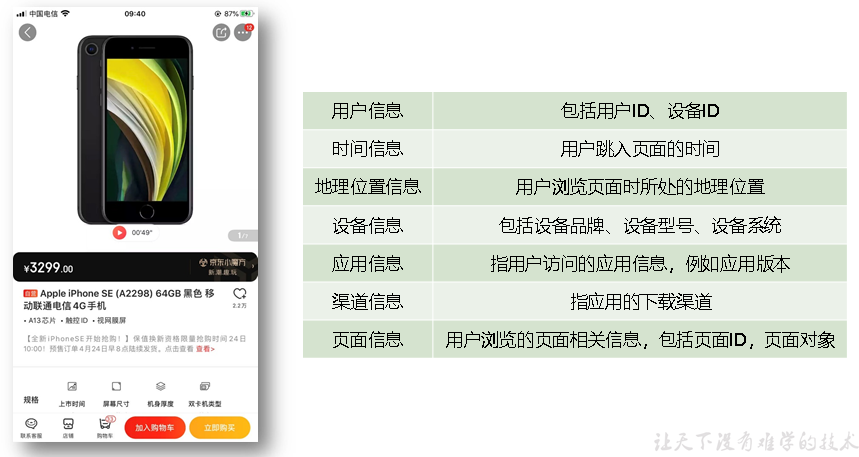
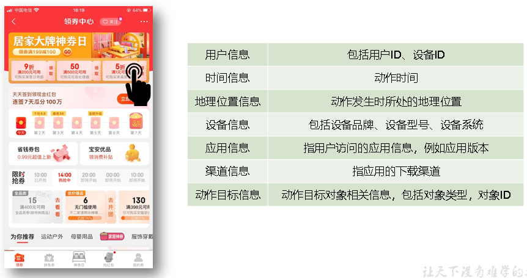

# 一、行为日志怎么生成？

用户行为日志的内容主要包括：用户的各项行为信息以及行为所处的环境信息。收集这些信息的目的主要是优化产品和为各项分析统计指标提供数据支持。收集这些信息的手段是**埋点**，目前主流的埋点方式有：

- **代码埋点：**通过调用埋点SDK函数，在需要埋点的业务逻辑功能位置调用接口，上报埋点数据。比如：对某个按钮进行埋点，当这个按钮被点击之后，可以在这个按钮的`onClick`函数里面调用SDK提供的数据发送接口，来发送数据
- **可视化埋点：**业务人员在页面上画圈，这些被画圈的地方由专业人员进行埋点，再把埋点的信息发送到指定的终端上
- **全埋点：**一般只有大公司在用，就是在每个页面，每个功能上面进行埋点，采集这个平台的所有数据。


# 二、行为日志内容

用户行为日志内容主要包括：页面浏览记录、动作记录、曝光记录、启动记录以及错误记录

## 1、页面浏览记录

记录访客对页面的浏览行为：



## 2、动作记录

记录用户的业务操作行为：




## 3、曝光记录

记录曝光行为：


## 4、启动记录

当用户启动APP的时候，一般会加载一段广告，在这个时间内可以埋点：


## 5、错误记录

启动记录，记录的是用户在使用应用过程中的报错行为，该行为的环境信息主要有用户信息、时间信息、地理位置信息、设备信息、应用信息、渠道信息、以及可能与报错相关的页面信息、动作信息、曝光信息和动作信息。

# 三、行为日志格式

日志结构大致分为两类：页面日志、启动日志

一条格式一般为`JSON`格式

## 1、页面日志

以页面浏览为单位，也就是说一个页面浏览记录，生成一条页面埋点日志

一条完整的页面日志包括：若干个用户在该页面所作的动作记录，若干个该页面商品的曝光记录，以及一个在该页面发生的报错记录

除了这些个行为信息，页面日志还包括了这些行为所处的各种环境信息，包括：用户信息、时间信息、地理位置信息、设备信息、应用信息、渠道信息等

比如：

```json
{
	"common": {                  	 -- 环境信息
		"ar": "230000",              -- 地区编码
		"ba": "iPhone",              -- 手机品牌
		"ch": "Appstore",            -- 渠道
		"is_new": "1",				 -- 是否首日使用，首次使用的当日，该字段值为1，过了24:00，该字段置为0。
		"md": "iPhone 8",            -- 手机型号
		"mid": "YXfhjAYH6As2z9Iq",   -- 设备id
		"os": "iOS 13.2.9",          -- 操作系统
		"uid": "485",                -- 会员id
		"vc": "v2.1.134"             -- app版本号
	},
	"actions": [                     -- 动作(事件)，因为可以有多个动作，所以这里是数组
		{
		  "action_id": "favor_add",  -- 动作id
		  "item": "3",               -- 目标id
		  "item_type": "sku_id",     -- 目标类型
		  "ts": 1585744376605        -- 动作时间戳
		}
	],
	"displays": [
		{
		  "displayType": "query",    -- 曝光类型
		  "item": "3",               -- 曝光对象id
		  "item_type": "sku_id",     -- 曝光对象类型
		  "order": 1,                --出现顺序
		  "pos_id": 2                --曝光位置
		},
		{
		  "displayType": "promotion",
		  "item": "6",
		  "item_type": "sku_id",
		  "order": 2, 
		  "pos_id": 1
		},
		{
		  "displayType": "promotion",
		  "item": "9",
		  "item_type": "sku_id",
		  "order": 3, 
		  "pos_id": 3
		},
		{
		  "displayType": "recommend",
		  "item": "6",
		  "item_type": "sku_id",
		  "order": 4, 
		  "pos_id": 2
		},
		{
		  "displayType": "query ",
		  "item": "6",
		  "item_type": "sku_id",
		  "order": 5, 
		  "pos_id": 1
		}
	],
	"page": {                       -- 页面信息
		"during_time": 7648,        -- 持续时间毫秒
		"item": "3",                -- 目标id
		"item_type": "sku_id",      -- 目标类型
		"last_page_id": "login",    -- 上页类型
		"page_id": "good_detail",   -- 页面ID
		"sourceType": "promotion"   -- 来源类型
	},
	"err":{                         -- 错误
		"error_code": "1234",       -- 错误码
		"msg": "***********"        -- 错误信息
	},
	"ts": 1585744374423             --跳入时间戳
}
```


## 2、启动日志

启动日志以启动为单位，即每次启动web/APP就会生成一条启动日志，一条完整的启动日志包括：一个启动记录、一个本次启动时的报错信息、启动时所处的环境信息，包括用户信息、时间信息、地理位置信息、设备信息、应用信息、渠道信息等

```json
{
	"common": {
		"ar": "370000",
		"ba": "Honor",
		"ch": "wandoujia",
		"is_new": "1",
		"md": "Honor 20s",
		"mid": "eQF5boERMJFOujcp",
		"os": "Android 11.0",
		"uid": "76",
		"vc": "v2.1.134"
	},
	"start": {   
		"entry": "icon",         -- icon手机图标  notice 通知   install 安装后启动
		"loading_time": 18803,   -- 启动加载时间
		"open_ad_id": 7,         -- 广告页ID
		"open_ad_ms": 3449,      -- 广告总共播放时间
		"open_ad_skip_ms": 1989  -- 用户跳过广告时点
	},
	"err":{                      -- 错误
		"error_code": "1234",    -- 错误码
		"msg": "***********"     -- 错误信息
	},
	"ts": 1585744304000
}
```


# 四、模拟生成用户行为日志


## 1、准备工作

在开始本项目之前，应该确保有一些基础环境，例如：Hadoop、Hive、Kafka、Flume等，如果没有安装，请访问下面的链接安装：

- 安装Hadoop：

  - [准备三台CentOS虚拟机](https://github.com/ZongqinWang/BigData/blob/main/Hadoop/2、准备三台虚拟机.md)

  - [安装Java、Hadoop以及编写集群分发脚本](https://github.com/ZongqinWang/BigData/blob/main/Hadoop/3、安装Java、Hadoop以及集群分发脚本.md)

  - [配置Hadoop集群](https://github.com/ZongqinWang/BigData/blob/main/Hadoop/4、配置Hadoop集群.md)

  - [群起集群并进行测试](https://github.com/ZongqinWang/BigData/blob/main/Hadoop/5、群起集群进行测试.md)

  - [编写Hadoop集群启停脚本以及查看集群Java进程脚本](https://github.com/ZongqinWang/BigData/blob/main/Hadoop/6、编写Hadoop集群启停脚本以及查看集群Java进程脚本.md)

- 安装Zookeeper：

  - [ Zookeeper 分布式安装部署](https://github.com/ZongqinWang/BigData/blob/main/Zookeeper/2、Zookeeper本地与分布式安装.md)

- 安装Hive：

  - [ Hive安装部署并替换derby为MySQL](https://github.com/ZongqinWang/BigData/blob/main/Hive/2、Hive安装部署并替换derby为MySQL.md)

- 安装Flume：

  - [Flume 分布式安装部署](https://github.com/ZongqinWang/BigData/blob/main/Flume/2、Flume分布式安装部署以及入门案例.md)

- 安装Kafka：

  - [Kafka 分布式安装部署](https://github.com/ZongqinWang/BigData/blob/main/Kafka/2、Kafka-分布式安装部署.md)

> 如果不想在本地虚拟机安装，可以在阿里云上租服务器安装，也很便宜哒！


## 2、模拟生成日志jar包介绍

我们不可能有真正的一个具有大数据流量的电商平台，于是需要自己模拟生成数据，模拟数据的`jar`包，[可以点击这串字前去下载](.\resource\模拟生成用户行为日志)

打开`hadoop102`主机，在`opt/module/`路径下新建一个目录：

```bash
[wzq@hadoop102 ~]$ cd /opt/module/
[wzq@hadoop102 module]$ mkdir applog
```

进入这个目录，将模拟生成数据下载过来的文件上传到这个目录下：

```bash
[wzq@hadoop102 applog]$ ll
总用量 15316
-rw-r--r--. 1 wzq wzq     1235 5月  18 19:57 application.yml
-rw-r--r--. 1 wzq wzq 15670411 5月  18 19:57 gmall2020-mock-log-2021-10-10.jar
drwxrwxr-x. 2 wzq wzq       32 5月  18 20:03 log			# 这个log文件是我已经运行过一次了，你们没有！！
-rw-r--r--. 1 wzq wzq     1101 5月  18 19:57 logback.xml
-rw-r--r--. 1 wzq wzq      693 5月  18 19:57 path.json
```


主要包含四个文件，一个jar包和三个配置文件，主要看一下这三个配置文件：

- `application.yml`：可以根据需求生成对应日期的文件

  ```yaml
  # 外部配置打开
  logging.config: "./logback.xml"
  #业务日期
  mock.date: "2020-06-14"
  
  #模拟数据发送模式
  mock.type: "log"
  #mock.type: "http"
  #mock.type: "kafka"
  #http模式下，发送的地址
  mock.url: "http://localhost:8090/applog"
  
  mock:
    kafka-server: "hdp1:9092,hdp2:9092,hdp3:9092"
    kafka-topic: "ODS_BASE_LOG"
  
  #启动次数
  mock.startup.count: 200
  #设备最大值
  mock.max.mid: 1000000
  #会员最大值
  mock.max.uid: 1000
  #商品最大值
  mock.max.sku-id: 35
  #页面平均访问时间
  mock.page.during-time-ms: 20000
  #错误概率 百分比
  mock.error.rate: 3
  #每条日志发送延迟 ms
  mock.log.sleep: 20
  #商品详情来源  用户查询，商品推广，智能推荐, 促销活动
  mock.detail.source-type-rate: "40:25:15:20"
  
  #领取购物券概率
  mock.if_get_coupon_rate: 75
  
  #购物券最大id
  mock.max.coupon-id: 3
  
  #搜索关键词  
  mock.search.keyword: "图书,小米,iphone11,电视,口红,ps5,苹果手机,小米盒子"
  
  # 男女浏览商品比重（35sku)
  mock.sku-weight.male: "10:10:10:10:10:10:10:5:5:5:5:5:10:10:10:10:12:12:12:12:12:5:5:5:5:3:3:3:3:3:3:3:3:10:10"
  mock.sku-weight.female: "1:1:1:1:1:1:1:5:5:5:5:5:1:1:1:1:2:2:2:2:2:8:8:8:8:15:15:15:15:15:15:15:15:1:1"
  ```

- `path.json`：该文件用来配置访问路径，可以根据需求，灵活配置用户访问路径。

  ```json
  [
    {"path":["home","good_list","good_detail","cart","trade","payment"],"rate":20 },
    {"path":["home","search","good_list","good_detail","login","good_detail","cart","trade","payment"],"rate":30 },
    {"path":["home","search","good_list","good_detail","login","register","good_detail","cart","trade","payment"],"rate":20 },
    {"path":["home","mine","orders_unpaid","trade","payment"],"rate":10 },
    {"path":["home","mine","orders_unpaid","good_detail","good_spec","comment","trade","payment"],"rate":5 },
    {"path":["home","mine","orders_unpaid","good_detail","good_spec","comment","home"],"rate":5 },
    {"path":["home","good_detail"],"rate":20 },
    {"path":["home"  ],"rate":10 }
  ]
  
  ```

- `logback.xml`：配置文件日志生成路径，就是生成的数据存放在哪里

  ```xml
  <?xml version="1.0" encoding="UTF-8"?>
  <configuration>
      <!-- 配置模拟生成的数据发送到/opt/module/applog/log/目录下 -->
      <property name="LOG_HOME" value="/opt/module/applog/log" />
      <appender name="console" class="ch.qos.logback.core.ConsoleAppender">
          <encoder>
              <pattern>%msg%n</pattern>
          </encoder>
      </appender>
  
      <appender name="rollingFile" class="ch.qos.logback.core.rolling.RollingFileAppender">
          <rollingPolicy class="ch.qos.logback.core.rolling.TimeBasedRollingPolicy">
              <fileNamePattern>${LOG_HOME}/app.%d{yyyy-MM-dd}.log</fileNamePattern>
          </rollingPolicy>
          <encoder>
              <pattern>%msg%n</pattern>
          </encoder>
      </appender>
      <!-- 将某一个包下日志单独打印日志 -->
      <logger name="com.atguigu.gmall2020.mock.log.util.LogUtil"
              level="INFO" additivity="false">
          <appender-ref ref="rollingFile" />
           <appender-ref ref="console" />
      </logger>
  
      <root level="error"  >
          <appender-ref ref="console" />
          <!-- <appender-ref ref="async-rollingFile" />  -->
      </root>
  </configuration>
  ```


## 3、如何使用？

使用这个脚本只需要使用以下命令就好了：

```bash
# 后台运行，并将该jar包自己的日志发送到黑洞里面
nohup java -jar gmall2020-mock-log-2021-10-10.jar 1>/dev/null 2>&1 &
```


ok，将这个脚本分发到`hadoop103`和`hadoop104`

```bash
[wzq@hadoop102 module]$ xysnc applog/
```

期望这个用户行为日志由`hadoop102`和`hadoop103`两台主机同时生成，于是可以写一个脚本同时生成用户行为日志数据

进入到家目录的bin目录下，创建脚本`lg.sh`：

```bash
[wzq@hadoop102 module]$ cd ~/bin/
[wzq@hadoop102 bin]$ vim lg.sh
```

输入以下内容：

```bash
#!/bin/bash
for i in hadoop102 hadoop103; do
	#statements
	echo "-------------------$i-------------------"
	ssh $i "cd /opt/module/applog; nohup java -jar gmall2020-mock-log-2021-10-10.jar 1>/dev/null 2>&1 &"
done
```

修改该文件的执行权限：

```bash
[wzq@hadoop102 bin]$ chmod +x lg.sh
```

以后只需要运行这个脚本就可以模拟生成用户行为日志数据了


# 参考资料

- [尚硅谷电商数仓V5.0学习视频](https://www.bilibili.com/video/BV1nf4y1F7Bn)